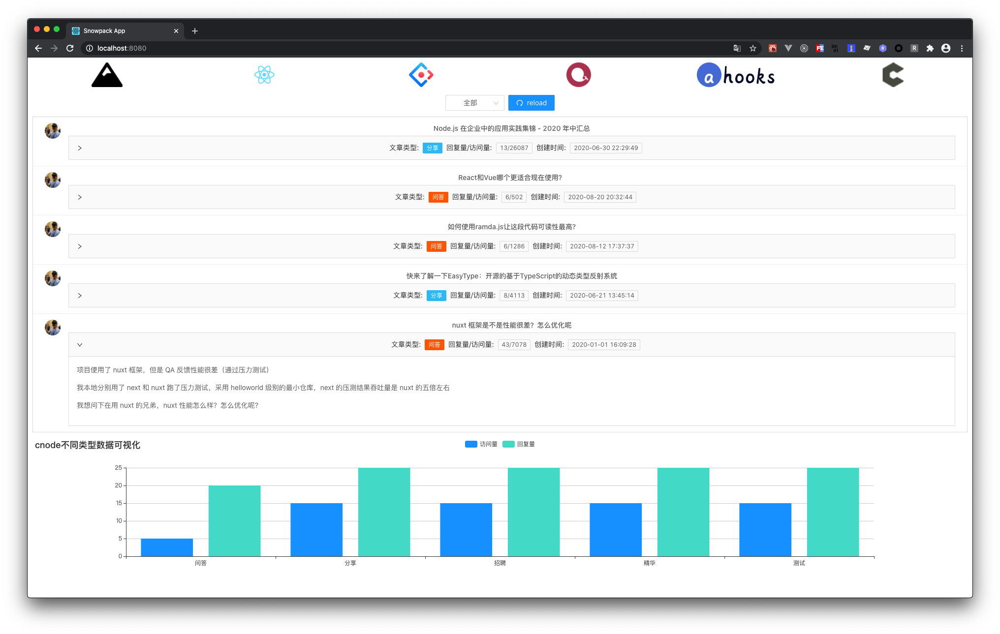

# 🚄 Snowpack + React + Ant Design + ECharts + ahooks 📦

[React](https://reactjs.org),[antd](https://ant.design/index-cn),[ECharts](https://echarts.apache.org), [ahooks](https://ahooks.js.org/), powered by [Snowpack](https://www.snowpack.dev).

该项目借助Snowpack利用现代浏览器原生支持ESModule模块加载能力实现 Bundless方案,在构建提效非常明显,其中结合企业级中后台场景,集成antd组件库、📈图表展示ECharts、时间处理moment、ahooks等、请求代理、接口数据来自cnode线上数据等,还原真实开发场景，开箱即用。

 

## 说明

> ✨ Bootstrapped with Create Snowpack App (CSA).

> 📦 还原真实开发场景，开箱即用

> 📣 对于IE或者低版本浏览器有要求的项目，谨慎选择

> ⭐ 如果觉得不错的话，您可以点右上角 "Star" 支持一下 谢谢！ ^_^

> 💛 或者您可以 "follow" 一下，我会不断开源更多的有趣的项目

> 📝 如有问题请直接在 Issues 中提，或者您发现问题并有非常好的解决方案，欢迎 PR 👍

## Available Scripts

### npm start

Runs the app in the development mode.
Open http://localhost:8080 to view it in the browser.

The page will reload if you make edits.
You will also see any lint errors in the console.

### npm test

Launches the test runner in the interactive watch mode.
See the section about running tests for more information.

### npm run build

Builds a static copy of your site to the `build/` folder.
Your app is ready to be deployed!

**For the best production performance:** Add a build bundler plugin like "@snowpack/plugin-webpack" or "@snowpack/plugin-parcel" to your `snowpack.config.json` config file.

### Q: What about Eject?

No eject needed! Snowpack guarantees zero lock-in, and CSA strives for the same.
